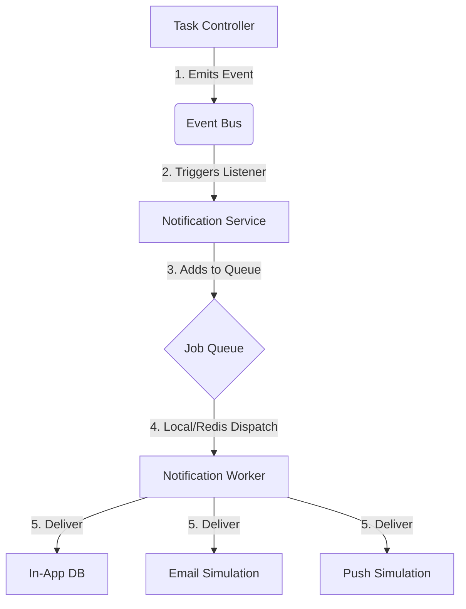

# Technical Architecture: Scalable Notification System

This document outlines the design decisions and technical flow of the event-driven notification system.

## 1. Design Philosophy
The system is built on the principle of **eventual consistency** and **asynchronous decoupling**. Instead of processing notifications during the request-response cycle, it uses an internal bus to offload work.

## 2. Component Diagram

## 3. Implementation Details

### Event Bus (`services/events.js`)
A singleton instance of Node's `EventEmitter`. This acts as the central nervous system of the application.

### Job Queue (`services/queue.js`)
Currently uses an **In-Memory Mock Queue**. 
- **Scalability**: The interface matches `BullMQ`. swapping back to a real Redis-backed queue only requires changing 10 lines of code in this file.
- **Reliability**: Uses `setImmediate` to ensure jobs are processed in the next tick of the event loop.

### Worker (`services/worker.js`)
A dedicated processor that handles different delivery logic based on the `channels` array provided in the job.

### Cron Jobs (`services/cronJobs.js`)
Uses `node-cron` to aggregate notifications into a daily digest. This reduces "notification fatigue" for users.

## 4. Scaling to Production
To handle millions of notifications:
1.  **Install Redis**.
2.  **Enable BullMQ**: Re-import `Queue` and `Worker` from `bullmq` in `services/queue.js` and `services/worker.js`.
3.  **Horizontal Scaling**: You can run multiple instances of `worker.js` on different servers, all pointing to the same Redis instance.
